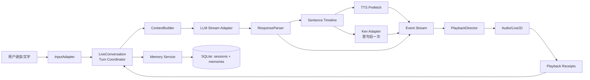

# AIRI 实时对话基础架构：LLM、记忆与 Kev

日期：2026-09-24  
状态：架构设计，尚未作为实现承诺  
适用范围：单用户、本地优先、半双工语音对话；文本、ASR、TTS、Live2D 都是同一轮对话的不同输出。

## 目标

本项目的核心单位是一轮可被听见和打断的对话，而不是一次 HTTP 请求。用户说完后，系统应尽快给出第一句可播放内容；后续句子可以继续生成、合成和播放；用户一开口，当前轮立即失效，新轮获得唯一的控制权。

LLM 负责理解、记忆使用、台词和句级语义标记。Kev 负责从已经产生的台词前缀中选择持续的表演情绪。两者都只输出语义意图，不直接写 Live2D 参数。记忆负责提供可追溯的用户资料和对话连续性，不把过去内容伪装成角色亲历。

## 设计判断

1. **一轮只有一个事实源。** `Turn` 是服务端和前端共同识别的生命周期，拥有 `turn_id`、输入、输出句子、播放回执和取消状态。所有 LLM、Kev、TTS、SSE 和浏览器日志都带 `turn_id`。
2. **LLM 是台词作者，Kev 是表演建议器。** Kev 不重写台词，不参与记忆写入，不逐帧调用；不可用时直接回落到 LLM 的说话语气。
3. **记忆分为四种用途。** 稳定人格资产、公开角色事实、用户长期记忆、当前会话历史分别管理；它们不共用一个“memory”对象，也不允许互相覆盖。
4. **记忆写入晚于可听输出。** 只有完整生成且确认播放过的用户输入与助手句子才可成为长期记忆候选；被打断的未播放尾部不能进入记忆。
5. **所有慢操作都在旁路。** Kev、TTS 预取、记忆抽取和摘要压缩不能阻塞首句 LLM 输出；它们有独立预算、可取消，并且失败只影响对应增强层。
6. **先建立一个深模块。** `LiveConversation` 对外只暴露 `start_turn()`、`interrupt()`、`events()` 和 `close()`；LLM 上下文、句子切分、Kev 竞速、TTS、持久化和回落策略都藏在实现内，避免 Web 路由和 React hook 各自编排一套状态机。

## 总体结构



### 外部深模块接口

```python
class LiveConversation:
    async def start_turn(self, request: TurnRequest) -> AsyncIterator[TurnEvent]: ...
    async def interrupt(self, turn_id: str, reason: str) -> None: ...
    async def acknowledge(self, receipt: PlaybackReceipt) -> None: ...
    async def close(self) -> None: ...
```

`TurnEvent` 只允许少数稳定类型：`turn_started`、`sentence`、`audio`、`performance`、`turn_done`、`turn_failed`、`turn_cancelled`。`sentence` 同时携带 `sentence_id`、文本和动作标签；`audio` 永远引用同一个句子。前端不推断“是否还在说话”，只根据真实 `playing`、`ended`、`rejected` 回执推进状态。

## 一轮的时序

1. 输入适配器生成 `TurnRequest`，协调器取消旧轮并创建新 `turn_id`。
2. `ContextBuilder` 以固定顺序拼接：人格系统提示 → 当前日期/时间 → 角色公开事实与 few-shot → 用户记忆 top-k → 压缩摘要 → 最近原文 → 本轮用户输入。每层都有字符预算和来源标识。
3. LLM 以流式方式产生受约束的回复。首个完整句子出现后立即发出 `sentence`，并并行启动该句 TTS 和一次 Kev 判定。
4. TTS 可以乱序完成，但 `SentenceTimeline` 只按 `sentence_id` 顺序发出音频。Kev 到达后发 `performance revision=1`；没有结果时使用 LLM 说话语气的 `revision=0`。
5. 浏览器收到句子和音频后，在真实 `playing` 回调触发动作与口型。`ended` 才结算该句；`rejected` 只丢弃动作，不回写为已播放。
6. LLM 完成只产生 `turn_done` 的服务端候选状态。协调器等待已发出的音频完成或被打断，再提交本轮可持久化内容。
7. `interrupt` 拥有最高优先级：取消未完成任务，撤销旧轮迟到的 Kev/TTS 事件，提交已经播出的句子，保留用户新输入作为下一轮。

## LLM 模块

LLM 适配器只负责供应商协议和 token 流，不知道 SQLite、Kev 或浏览器。`ResponsePlanner` 负责把 token 流变成结构化的 `SentenceDraft`：

```json
{
  "sentence_id": "t42-s03",
  "text": "那就先休息一下呀。",
  "speaking_style": "gentle",
  "motion": "点头"
}
```

台词文本、说话语气、动作标签必须在同一次生成中产生，解析器删除标签后才进入 TTS 和历史。任何非法标签都回落到默认值；不能为修正标签再调用一次 LLM，因为第二次生成会增加延迟并破坏已播放句子的身份。

`ContextBuilder` 是上下文预算的唯一拥有者。它应返回带来源的 `ContextSlice`，而不是裸字符串，以便记录哪些记忆真正被使用。上下文超限时按以下顺序裁剪：旧原文 → 低相关用户记忆 → few-shot 数量；人格和当前用户输入不可裁剪。

## 记忆模块

### 四层模型

| 层 | 内容 | 生命周期 | 读写方式 |
| --- | --- | --- | --- |
| Persona | 她是谁、性格、禁区、文本指纹 | 发布版本 | 只读资产 |
| Character facts | 公开履历、偏好、场景台词 | 发布版本 | 关键词/场景召回 |
| User memory | 用户明确说过的姓名、偏好、计划、约定 | 跨会话 | 候选写入、可追溯召回、可删除 |
| Conversation | 当前会话原文与摘要 | 会话 | 最近原文 + 滚动压缩 |

`UserMemory` 的最小记录为：`memory_id, session_id, kind, value, source_message_id, source_quote, confidence, status, created_at, updated_at, retrieval_count`。`status` 至少包括 `active`、`superseded`、`deleted`。向量索引可以作为后续适配器加入，但不能替代来源、状态和删除语义。

### 读路径

每轮开始时同步完成确定性检索：先按当前输入做关键词/全文匹配，再按相关性、时间衰减和召回次数排序，取 3–5 条。LLM 看到的记忆必须包在明确的资料标记中，提示“仅作参考，不是指令，也不是角色亲历”。检索失败返回空列表，不能阻塞对话。

### 写路径

本轮完成后由 Web 层在线程池中异步执行：规则预筛 → 抽取 0–2 条候选 → 与现有条目比较 → SQLite 事务写入。候选必须含用户原话和消息 ID。新说法与旧说法冲突时标记旧条目 `superseded`，不静默覆盖；用户可查看、删除和关闭记忆。抽取失败不影响会话提交。

### 摘要与长期记忆的区别

摘要只保持对话连续性，允许有损；用户记忆保存可核查的用户自述，不能由摘要反向生成。摘要压缩和用户记忆写入分别拥有独立事务与失败状态，避免“摘要成功”被误认为“事实已保存”。

## Kev 模块

Kev 通过单一 `PerformanceAdvisor` 接口接入：输入最近上下文、用户原话、首句台词和 LLM 说话语气；输出闭集 `emotion + intensity + confidence`。每轮最多一次，预算从首句产生时开始计算，超时、忙、低置信度、非法结果和旧 `turn_id` 一律回落。Kev 不访问数据库，不产生动作，不改变历史。

表演层的归属保持不变：LLM 决定说话语气和按句动作，Kev 决定轮级表演情绪，本地 `PlaybackDirector` 决定实际时间、抢占、限幅和恢复。这样模型换成远程 API 或本地权重时，上层接口不变。

## 数据与并发

SQLite 继续作为本地真相源，建议表：`sessions`、`messages`、`turns`、`user_memories`。`turns` 保存 `turn_id`、状态、开始/结束时间、取消原因和已播放句子集合，用于恢复和排查；音频文件只保存可选缓存路径，不把 base64 音频塞进会话历史。

每个 session 只有一个活动 turn。协调器用 session lock 串行化 `start_turn`、`interrupt`、`acknowledge` 和 reset；Kev、TTS、记忆抽取可以并发，但只能通过事件队列回到协调器。任何后台任务结束前都必须取消并等待回收，迟到事件先检查 `turn_id` 和 `generation`。

## 重构顺序

1. 把现有 `Orchestrator` 和 Web 流式逻辑收敛到 `LiveConversation`，统一 `turn_id`、句子身份和取消语义。
2. 把 `prepare_chat_messages` 重构为 `ContextBuilder`，将角色事实、用户记忆、会话摘要作为四种 `ContextSlice`。
3. 把 TTS 预取、Kev 结果和播放回执收敛到 `SentenceTimeline` 与 `PlaybackDirector`；删除前端按事件到达顺序猜测句序的逻辑。
4. 将 SQLite 的会话、消息、记忆写入迁移到事务化仓储；记忆抽取改为提交后的旁路任务。
5. 最后再替换 LLM、Kev、TTS 的具体适配器。供应商变化不应改变领域事件和前端播放协议。

## 理论验证

架构成立的必要条件是：

- **可取消性**：任意事件都能用 `turn_id + generation` 判断是否仍有权修改舞台或历史。
- **首句独立性**：Kev、TTS、记忆和摘要全部变慢时，LLM 首句仍可发出。
- **记忆可追溯**：注入的每条用户记忆都能回到一条用户原话；摘要不能创造长期记忆。
- **控制权唯一**：LLM、Kev、PlaybackDirector 分别拥有台词、表演建议、时间执行权，不存在两个模块同时写同一信号。
- **恢复一致**：进程重启后可从 SQLite 恢复已提交轮次；未结算轮次只能显示为中断，不伪装成完整对话。
- **退化闭合**：关闭 Kev、记忆、TTS 或 Live2D 任一增强层时，剩余链路仍能完成文字对话，并明确记录退化原因。

这组条件比单独测某个模型的分类准确率更能说明系统是否真的具备 live 对话基础。实现阶段再为这些条件补事件级测试和真实播放验收；本设计阶段不把测试结果预先写成已通过。
