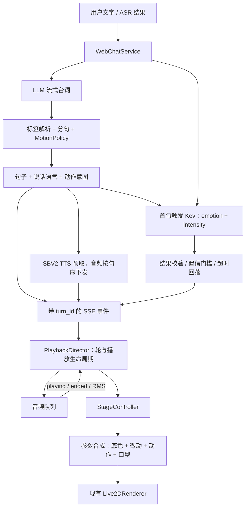

# Kev + LLM 联合控制人物：架构与实施计划

日期：2026-09-23。状态：待实施设计，不代表功能已交付。代码基线：`232b7c6`。

## 1. 推荐方案

沿用本项目已有分工，做成**LLM 生成台词与句级动作、Kev 判定轮级表演情绪、确定性播放控制负责同步、Live2D 参数合成负责执行**的架构。

LLM 和 Kev 输出有限的语义意图，均不直接写模型参数。人物最终如何动、什么时候动、冲突时谁让路，由本地代码决定。这样既能让动作与说话内容一致，又能让脸和身体保持连续的表演底色，并使超时、打断、音频失败都可测试。

首版范围：现有六类表演情绪、三类动作、实际播放音频驱动口型、空闲微动、半双工打断。目标是当前花音对话页面可运行、可录屏验收；不以训练新模型、增加动作资产或切换语音引擎为前置条件。

本方案遵守 [CONTEXT.md](../CONTEXT.md)、[ADR 0001](adr/0001-motion-labels-llm-owned.md)、[ADR 0002](adr/0002-cheap-interrupt-before-full-duplex.md)。Kev 的调用从轮末前移到首句，改变的是调度时机，不改变其控制归属。开源源码与性能数据见[调研笔记](research-kev-llm-character-control.md)。

## 2. 当前基础与真正需要补的部分

以下以代码为准，不直接沿用旧改善文档对“现状”的描述。

| 环节 | 已有实现 | 本次要补齐 |
| --- | --- | --- |
| 台词和标签 | `dialogue/persona.py`、`speaking_style.py`、`motion.py`；轮级说话语气、句前动作标签 | 保留闭集与清洗，不增加第二次台词生成 |
| Kev 接入 | `dialogue/jev_client.py` 兼容本地 `/v1/systemone`，一次问 emotion/intensity；2 秒超时、低分回落、失败冷却 | 首句发起，结果完成即下发，输入说明“当前回复前缀”，校验非法值、总时间预算和并发 |
| 服务端管线 | `frontend/web.py` 中 TTS 预取和音频序号已实现 | 当前 Kev 在完整回复生成后才启动；阻塞等待 TTS 时也要能发出 Kev 结果和响应打断 |
| 动作与音频 | `useChat.ts` 把动作配到句序，`useAudioQueue.ts` 在 `playItem` 回调 | 当前回调在 `audio.play()` 之前，浏览器拒播时仍可能做动作；改为真实 `playing` 事件 |
| 表演情绪 | `App.tsx` 收到 performance 立即写舞台 | 增加 turn_id 和本地播放状态，阻止新轮/旧轮表情串线 |
| 参数合成 | `stage.ts` 已有 Soullink runtime、程序化动作与嘴部覆盖；`blend.ts` 已有正弦摆动 | 核实 renderer 更新顺序、单一参数写入方、参数限幅和动作收尾；不是从零做 idle |
| 打断 | 淡出音频、请求后端 interrupt、取消在飞任务 | 立即废弃本轮表演更新；在等待 token/TTS 时也能响应；停止动作和旧轮定时器 |
| 观测 | `frontend/turn_timing.py` 记录服务端事件时间 | 增加浏览器实际起播、表情生效、动作开始/结束、可听停止时间 |

**语音现状必须单独说明：** `TTSClient.synthesize()` 接收但忽略 `ref_audio_path/ref_text/style` 等参数，向锁定花音的 SBV2 服务只发送 `text`；`_default_service()` 也没有加载参考音库。根领域文档仍描述“说话语气选择参考音”，两者有差异。本期让说话语气继续作为文本生成意图和表演情绪回落依据，不声称已有六类可控声学风格。恢复语气到 SBV2 style 的真实映射，应作为后续独立能力，先验证现有模型是否支持，再同步领域约定。

## 3. 控制权和架构

### 3.1 每种信号只有一个最终归属

| 信号 | 决策方 | 粒度 | 执行方式 |
| --- | --- | --- | --- |
| 人格、性格、事实、台词 | LLM，复用现有人格资产 | 会话 / 轮 | 既有 prompt 与对话历史 |
| 说话语气 | LLM 标签 | 每轮一次 | 清洗后作为本轮元数据；当前语音仍由锁定 SBV2 合成 |
| 表演情绪与强度 | Kev；不可用时回落说话语气 | 每轮最多一次有效 Kev 覆盖 | 平滑改变脸和身体的持续底色 |
| 点头、摇头、歪头 | LLM 标签 + `MotionPolicy` | 按句，可缺省 | 实际起播触发；同一轮可按句重复、占线丢弃 |
| 嘴部开合 | 正在播放的合成音频 | 每帧 | RMS 平滑，停止/静音时收口 |
| 呼吸、眨眼、微动 | 确定性本地运行时 | 连续 | 使用模型能力与固定参数配方，不请求模型 |
| 取消、去重、限幅、恢复 | 本地代码 | 事件 / 每帧 | 以轮标识、句序与播放生命周期为依据 |



继续使用 FastAPI + SSE、现有 LLM 客户端、独立 Kev 进程、独立 SBV2 进程、React + Soullink。无需消息队列、数据库事件总线或 WebSocket。增加的逻辑集中在三个 Module，而不是把事件判断散落到每个 React 回调里。

### 3.2 Module 与 Interface

1. **轮内事件调度 Module**：仍由 `WebChatService.stream()` 对外提供异步事件流。内部持有 LLM 读取任务、有界 TTS 队列、单次 Kev 任务和 interrupt 等待任务；外部只消费事件。若文件明显变大，将实现移至 `dialogue/turn_stream.py`，不预先拆十几个小封装。
2. **Kev 判定 Module**：保留现有 `JevClient` 名称与配置兼容性，扩展 `ask_messages(..., response_is_partial=True)` 等输入语义，返回已验证的 `PerformanceDecision | None`。HTTP、供应方格式、分数校验和冷却留在此处。调用方不用理解 Kev logits。
3. **PlaybackDirector Module**：新增 `frontend/src/playback/director.ts`，作为纯状态与效果决策 Module。Interface 建议为 `dispatch(event) -> effects[]`，注入单调时钟；输入包括轮开始、服务端事件、实际起播/停播、打断。输出为入队、表情更新、动作开始/停止等有限效果，由 hooks 执行。音频对象与 DOM 留在现有 hooks 中。

`StageController` 是现有渲染 seam，继续保留 `setMouth / setPerformance / playMotion / resetIdle / destroy`，按实现需要补 `stopMotion`。Soullink profile 与已有 `blendParams` 回落是实际存在的两条渲染路径，统一经过同一套动作、限幅、口型规则；不另造通用 provider 框架。

## 4. 一轮对话如何运行

### 4.1 主时序

1. 用户发送后生成 `turn_id`（UUID），请求携带该值，服务端校验并原样回传。所有事件、音频条目、浏览器日志都带同一个 ID。
2. LLM 先给说话语气；服务端立即生成 `revision=0` 的 fallback performance，但浏览器先为本轮缓存它。
3. 第一个清洗后的非空句子出现时，在同一次调度中启动该句 TTS 和本轮唯一一次 Kev 请求，双方互不等待。Kev 输入是最近对话、最新用户消息、角色本轮已生成的首句，并明确这是未完成回复的前缀。
4. Kev 完成且通过校验，就产生 `revision=1` 的 performance。即使 LLM 正在等 token 或 TTS 正在合成，也能立刻下发。
5. 首句音频真实触发 `playing` 后，激活本轮底色、弹出对应台词、触发该句动作；嘴部跟随实际音频。若 Kev 还没到，用说话语气回落。
6. 播放中 Kev 到达，则用约 250ms 的过渡覆盖底色，不重播动作；播放间隙缓存最新底色，下一句起播继续用它。每轮只接受一个有效 Kev 覆盖，避免反复改脸。
7. `done` 只表示服务端输出结束；所有本轮音频播放完，才算表演结束。然后平滑回到日常 idle。首句尚未播放时到达 `done`，不能把已排队音频误判为过期。

有新输入时，先终止上一轮的剩余表演与音频，再开始新轮。用户暂停、浏览器缓冲、历史重播都作为显式播放事件，不凭 `chat.busy` 判断是否还在说话。

### 4.2 为什么“提前创建 Kev task”还不够

旧 [P0-2](improvements/done/p0-02-jev-early-dispatch.md) 的方向可复用，但若仍在流尾 `await` 并 `yield performance`，客户端依旧只能在流尾收到结果。本方案要求**提前请求和提前交付同时完成**。

推荐实现为一个串行调度循环：对当前 `anext(llm_stream)`、最旧待发送 TTS、Kev 和 interrupt 使用 `asyncio.wait(..., FIRST_COMPLETED)`；每次只保留一个 LLM 读取任务。已完成 Kev 立即输出；音频按句序输出；队列达到既有预取深度时暂停继续读取 LLM，避免无限囤积文本/音频。同一轮的事件由这个循环统一 yield，避免多个协程同时写 SSE。

约束：

- interrupt 与其他事件同时完成时，取消优先，不能再发新音频/动作。
- Kev 在首句后仅调一次，不逐 token、不逐帧请求，不等全文再纠正一次。
- 复用当前 2 秒作为初始请求总预算；覆盖排队、连接、推理、读取全过程，不能只依赖 HTTPX 分段超时。预算用完保持 fallback。
- LLM 与全部 TTS 完成后，取消仍未完成的 Kev 并发送 `done`，不为辅助表演延长回复收尾。这样可能放弃短回复的迟到判定，属于明确取舍。
- 所有任务在取消、断连、异常时均 cancel 并 await 回收；取消异常不触发供应方失败冷却。

### 4.3 Kev 输入与质量门槛

延续两个英文 choice 问题：`emotion={casual, energetic, gentle, playful, defiant, surprised}`，`intensity={mild, moderate, strong}`；结果映射回现有中文闭集与 0.6/0.9/1.0 强度。台词和用户文本保持原语言，不额外串联翻译调用。

输入保留最近六条的预算，但明确标注最新用户消息和 assistant prefix；问“角色此刻应如何表演”，避免把用户的悲伤直接映射为角色哭脸。模型指令与对话引用分区；对话内容只当数据。沉重话题温柔接住、无哭脸的约束沿用现有标准。

Kev 的 choice confidence 是对候选 softmax 最大概率按均匀基线归一化的分数，**不是判对概率**。六类时 `confidence=(pmax−1/6)/(1−1/6)`；现有 0.4 门槛仅作起始值，不能解释为“40% 准确率”。具体源码和基准出处见调研笔记。

接受规则：emotion 必须在闭集；confidence 必须为有限数且位于 [0,1] 并过门槛；intensity 同样校验标签和分数，缺失/低分时使用默认中等强度，不因此丢掉有效 emotion；异常响应不得导致主对话失败。每种回落记录 reason：disabled、timeout、busy、cooldown、invalid、low_confidence、expired。

Kev 响应中的 `latency_ms` 在取得推理锁后才开始计时，不含排队；观测必须使用客户端总耗时。本地 Kev 服务已有串行推理锁，因此应用侧限制每个 Kev 实例同时一个在飞请求；忙时直接回落，不排长队。多会话能力等实际需求出现再做批处理评估。连接池随应用生命周期创建和关闭，进程取消不保证已经开始的 GPU 推理能立即停，因此迟到结果仍须丢弃。

## 5. 事件协议与播放规则

### 5.1 目标协议（不是当前已有字段）

保持 SSE，建议同仓前后端一次同步升级到 v2。把独立 motion 事件合并进对应 sentence，消除“暂存给下一句”的隐式约束：

```json
{"v":2,"type":"sentence","turn_id":"uuid","index":0,"text":"我在这里呢。","motion":"点头"}
{"v":2,"type":"performance","turn_id":"uuid","revision":0,"emotion":"温柔","intensity":0.9,"confidence":0,"source":"speaking_style","decay_ms":0}
{"v":2,"type":"performance","turn_id":"uuid","revision":1,"emotion":"温柔","intensity":0.6,"confidence":0.73,"source":"kev","decay_ms":0}
{"v":2,"type":"audio","turn_id":"uuid","index":0,"audio":"<base64 WAV>"}
{"v":2,"type":"done","turn_id":"uuid","sentence_count":1}
```

示例展示形状，不代表到达顺序；通常 fallback 先于 sentence。其余 `audio_error/error/interrupted/timing` 同样带 `v/turn_id`；audio_error 保留 index；sentence 的 motion 可为 null。兼容托管 Jev 时 source 为 `jev`，不能把本地 Kev 的日志继续标作 Jev。代码类名和 YAML 段名本期无需迁移。

协议不变量：

- index 是本轮清洗后可见句子的零基序号；sentence 必须先于相同 index 的 audio/audio_error。
- 每句恰有一个合成终态：audio 或 audio_error；合成失败不挪动后续 index。
- `(turn_id,index)` 去重音频/句子；performance 只接受递增 revision；closed turn 的新事件不再驱动舞台。
- done 和 interrupted 是不同终态。error 应关闭生成状态，保留已安全入队的成功音频或按明确错误策略停止，不能留在永久 busy。
- `frontend/src/types.ts`、`api/client.ts` 的运行时校验、`useChat.ts`、服务端和协议测试必须同批更新。现有客户端拒绝未知事件，不假定加字段/改 source 后自然兼容。

### 5.2 播放状态：生成和播放分开

分别维护 generation=`open | done | cancelled | error` 与 playback=`waiting | playing | paused | drained | cancelled`。generation=done 且 playback=playing 是正常状态。

`PlaybackDirector` 保存当前轮、按 index 存储的句子/音频状态、缓存底色、已触发动作集合。全部音频已结束或失败且收到生成终态，才能 drained；取消则立即 closed。音频队列消费“下一条尚未消费的句子”，不能依赖数组最后一项，避免批量到达时跳句。

| 情况 | 确定性行为 |
| --- | --- |
| `play()` 被浏览器拒绝 | 标记待用户播放；不触发动作，不启动惊讶衰减 |
| `playing` 首次触发 | 才产生 sentence_started；同一播放实例只触发一次动作 |
| 暂停 / waiting 缓冲 | 嘴部归零；动作按该音频 currentTime 冻结，恢复不重复触发 |
| 音频 error / TTS 失败 | 跳过该句动作，推进下一句；台词仍可在记录查看 |
| Kev 在起播前到达 | 缓存，起播时采用最新有效底色 |
| Kev 在本轮结束/取消后到达 | 丢弃；不作用于下一轮 |
| 惊讶衰减 | 从首次实际应用时计时 1200ms；回到本轮非惊讶 fallback，没有则日常；不得回到上一轮底色 |
| 历史音频重播 | 仅驱动音频和口型，首版不重演动作或修改当前轮底色；新对话开始时停止重播 |

动作曲线默认 0.8–1.0 秒，但实际句子可能更短。能取得音频 duration 时，将动作时长缩到不超过剩余播放窗；不足 250ms 的短句跳过动作。ended/error/interrupt 时停止或快速释放动作，不让它延续到下一句。具体 250ms 是待录屏调参的起始值。

### 5.3 打断必须跨越全部路径

浏览器先将轮标记 cancelled，拒绝新 performance/audio；停止动作、取消表情计时器、淡出声音并收口，再并行请求服务端 interrupt。即使 SSE 已 done、浏览器仍在播放，也能让路。服务端在等 LLM token 或 TTS 时要能被 interrupt 唤醒。

现有后端用“已经送出 sentence”近似“已经播出”，与领域约定有差距。本期同步控制先不宣称修好了历史精度。若要达成完整打断验收，在后续阶段增加播放回执：`POST /api/playback` 携带 turn_id、单调 event_seq、index、started/ended；服务端只接受该会话已发音频的索引，幂等处理，并在同一会话锁内裁剪被打断回复。客户端 interrupt 同时带已开始播放的最高 index，解决回执和 interrupt 乱序；无回执明确使用旧近似。首版以“已开始的句子”整句保留，不伪称能精确到已经听见的字。

## 6. Live2D 参数合成

语义层不得知道 `ParamAngleX`。参数配方留在 `frontend/src/live2d/`，并继续复用现有 Soullink profile 和 fallback 配方。

合成示意：`P = clamp(P_base + Δidle + w(t)·Δmotion)`；嘴部、眼部单独定义所有权，不能把所有参数无差别求和。

| 参数组 | 所有权与合成 |
| --- | --- |
| 头部/身体角度 | 表演底色 + 低幅微动 + 一个离散动作；结束回到底色 |
| 眉毛/微笑/嘴形 | 表演底色控制；首版 RMS 只控制嘴部开合，不猜元音 |
| 睁眼 | 情绪目标与眨眼相乘；确认 runtime/资产谁负责眨眼，只留一个写入方 |
| 嘴部开合 | 真实音频 RMS 最终覆盖；淡出期间乘实际 gain，避免已经听不见还在张嘴；结束平滑归零 |
| 物理参数 | 保留资产物理计算；不在两个 ticker 反复写同一受控参数 |

实施先检查已安装 `@soullink-emotion/live2d-pixi` 的 `setParameters` 和 `beforeModelUpdate` 挂点，再对照模型实际帧更新次序。不能仅凭业务代码里“最后赋值”就认定最终画面不会被内建 motion/physics 覆盖。上游 `beforeModelUpdate` 位于 physics 之后，首版可保证绘制叠加；若要求头部动作同时驱动发丝等物理反应，需另外核验 physics 前的挂点。

加载模型时读取真实参数 ID、min/max/default，缺失参数忽略并在调试记录一次；有别名的模型用 profile 映射。最终按模型范围限幅，动作前后不累积上帧偏移。兼容任意 Cubism 4 的含义是能运行并优雅降级，不保证每个皮套都有完整动作表现。

先审计当前 runtime 的 idle 和 lip sync：它们已被启用，fallback 也已有摆动，不能无条件叠加另一套呼吸/眨眼。缺项才补低幅呼吸或视线；如果 runtime 内建口型会与外部 RMS 冲突，就只保留外部驱动。表情插值统一在一处完成，避免 runtime 和业务层两次平滑导致迟滞。

## 7. 调研结论如何用于本项目

| 资料 | 已核实、可借鉴的部分 | 本项目采用方式 |
| --- | --- | --- |
| `jaredpalmer/kev` | state + questions 的闭集判定，emotion/intensity 可同次请求；confidence 有明确变换公式；HTTP 推理串行 | 作为轻量表演判定器，实测中文数据；不当作逐帧动作生成模型 |
| `moeru-ai/airi` | 文本控制流、语音排队、Live2D 分阶段参数控制的源码模式 | 借鉴事件与音频同步、单一合成顺序；保留本项目的 Kev/LLM 职责分配 |
| pixi-live2d-display 的 Cubism 4 实现 | motion、眨眼、表情、呼吸、物理、口型有更新次序；参数具备范围 | 用现有 renderer 的真实挂点执行合成，调试验证参数是否被覆盖 |

Kev 官方给出的 L4、Apple Silicon 延迟是特定模型、输入和测量方式下的基准，不能当作本机 HTTP P95。无需先微调；先用本项目中文短句、沉重话题和玩笑数据检验准确性与耗时。详细链接、固定版本、基准条件见调研笔记。

## 8. 实施 plan

以下按一个熟悉本仓库的开发者估算有效工作日，不包含新皮套制作、模型训练和等待人工盲测。每阶段可单独提交、可回退，功能关闭时保持说话语气 fallback。

| 阶段 | 交付与主要文件 | 验收条件 | 估时 |
| --- | --- | --- | --- |
| P0 基线与能力核实 | 调试脚本/固定回放集；`frontend/turn_timing.py`、`frontend/src/debug.ts`；记录当前模型参数和 runtime 写入顺序 | 记录至少 60 轮基线；区分服务端下发与真实起播；确定 Kev 版本和本机资源占用 | 1 天 |
| P1 协议和播放生命周期 | v2 turn_id/index；`frontend/web.py`、`types.ts`、`api/client.ts`、`useChat.ts`、`useAudioQueue.ts`；新增 `playback/director.ts` | 拒播无动作；乱序/重复不跳句；done 后仍正常播完；新轮不继承旧轮状态 | 2–3 天 |
| P2 Kev 提前且非阻塞交付 | `frontend/web.py` 的调度循环；`dialogue/jev_client.py`、`performance.py`、`config.py` | 首句即请求；结果完成即可下发；Kev 慢/挂不阻塞首音和结束；等待 TTS/token 时能打断 | 2 天 |
| P3 舞台合成和收尾 | `stage.ts`、`blend.ts`、`App.tsx`、`Live2DStage.tsx`、调试页 | 参数限幅；动作不越句；惊讶不串轮；打断收口、回 idle；两条渲染路径均通过 | 1–2 天 |
| P4 评测与调参 | Kev 门槛评测、浏览器日志、录屏盲测报告 | 通过下节功能和质量验收，给出启用/回落结论 | 1–2 天 |
| P5 精确打断历史（后续） | 播放回执、会话内索引账本、conversation 修剪、对应前后端测试 | 打断后不把尚未起播的句子写入有效历史；处理回执迟到与新轮竞争 | 1–2 天 |

P0 → P1 → P2 → P3 → P4 为首个可用版本，约 7–10 个有效工作日；P5 是现有历史近似的独立修正。第一批实现建议先交付 **P1 + P2**：已有台词、声音、程序化动作可直接复用，最早获得真实的 Kev + LLM 联合控制收益。

部署沿用 `scripts/run_kev.sh`、`jev` 配置和现有 SBV2 启动方式。当前脚本假设 Kev 使用 GPU 0、TTS 使用 GPU 1；实现前验证本机设备与并发显存，不假定一定有双卡。单卡先限 Kev 并发并记录与 TTS 同时运行的 P95；若竞争损害语音，先关 Kev 回落，不自动把另一个型号替换进正式链路。固定 Kev 代码与权重 revision，健康检查和一次预热后再开始采样。

## 9. 验证与可观测性

### 9.1 自动化验证

后端沿用 pytest + fake LLM/TTS/Kev，使用事件屏障控制任务完成次序，避免靠 sleep 碰概率：

- 首句后 Kev 已启动，但 LLM 尚未结束；Kev 完成时，TTS 仍阻塞，客户端也能收到 performance。
- Kev 超时、关闭、低分、NaN/无穷、未知标签、强度缺失都可回落；主对话成功。
- LLM/TTS 正在等待时打断；后续无音频/表演输出，后台任务回收。
- TTS 预取不超上限；音频/失败事件按 index 完整对应，结束不漏尾句。

前端当前没有测试命令；P1 增加 Vitest 验证纯 director 状态，必要的浏览器行为用 Playwright 和本地 fixture 音频验证：

- `play()` reject、playing 重入、暂停恢复、短句、audio_error、SSE done 后排队播放。
- cancelled turn 的迟到音频/performance 和旧定时器不能改新轮；同一动作不重复触发。
- profile 缺失、参数缺失、模型范围较小；动作归零，无越界和帧间漂移。
- 浏览器真实音频起播触发舞台动作，结束与打断收口；持续观察而非只测函数调用顺序。

实现时执行 `pytest tests/test_web.py tests/test_jev_client.py tests/test_performance.py tests/test_motion.py tests/test_turn_timing.py`、新增前端测试和 `npm run build`，再执行受影响的完整测试集。本次仅写方案，不把这些检查写成已通过。

### 9.2 指标口径与建议验收线

以下数值是本方案提出的工程目标，P0 后根据设备和录屏结果校准，不是已测得的结果：

| 指标 | 定义与目标 |
| --- | --- |
| 首音回归 | 浏览器 send → 首次 playing；同机交错测开/关 Kev 各至少 60 轮，P95 增量目标 ≤100ms；报告原始分布 |
| 表演覆盖 | 有效 Kev 判定在第二个成功句子起播前已应用的多句轮占比；目标 ≥90%；同时报告全部轮的有效判定率，不能靠大量回落美化指标 |
| 动作同步 | 动作开始位于所属句的播放窗，playing → 动作开始 P95 ≤100ms；无拒播动作、无跨句残留 |
| 打断 | 点击/开始录音 → 可听音停止 P95 ≤300ms；不再出现旧轮动作或迟到表情 |
| 表演质量 | 按 CONTEXT：日常/沉重/玩笑各 20 轮，共 60 轮录屏；动作语义冲突、错窗、长期缺失为否决项，不追求动作覆盖率 |
| 参数正确性 | 正常、profile 回落、缺参模型三种条件下无异常、无超范围写入；帧耗时与 P0 基线比较 |

浏览器日志记录 `turn_id,index,received,playing,ended,performance_applied,motion_start,motion_end,interrupt,audible_stop`，使用 `performance.now()`；服务器使用自己的单调时钟记录 dispatch/done/sent。两端靠 ID 关联，各自计算时间差，**不直接相减两台时钟的绝对值**。旧 `first_audio_ms/audio_gaps_ms` 继续注明只是服务端发送近似值。

Kev 质量评测先用 30 条开发样本调门槛，再用独立 60 条留出样本检验；人工允许标注多个合理表演标签，重点记录危险错配、回落比例和强度过度，不拿单一分类准确率代替最终录屏体验。首句包含“哎呀”但后面转为安慰的样本要专门覆盖，这是提前判定最容易失误的情况。

## 10. 取舍与扩展条件

- **保持轮级表演情绪。** 若首句证据不足，接受 fallback；确需句级情绪和反转时，再评估新 ADR、请求频率和播放生效点，不在本版偷偷改语义。
- **LLM 动作闭集保持三个。** 新增挥手、耸肩等先有资产/曲线与能力检测，再改词表和 prompt；不能由模型编造动画名。
- **先把 RMS 开合做稳。** 元音口型只有在现有皮套嘴形与评测证据支持时再上；简单频带能量不等同可靠的音素识别。
- **不依赖完整动画包。** 程序化小动作足够验证架构；真实皮套到货只替换配方或增加支持的动作。
- **最小退化路径始终可用。** Kev 不可用 → 说话语气底色；Soullink profile 不可用 → `blendParams`；动作参数缺失 → 不执行该动作；语音失败 → 文字记录保留。失败不会再触发一次 LLM 来补救。

完成 P1–P4 后，联合控制的可见结果应是：角色在对应句实际开口时做出有语义的动作，Kev 及时调整整轮脸和身体的底色，口型严格跟随声音，用户打断后所有层同时让路。
